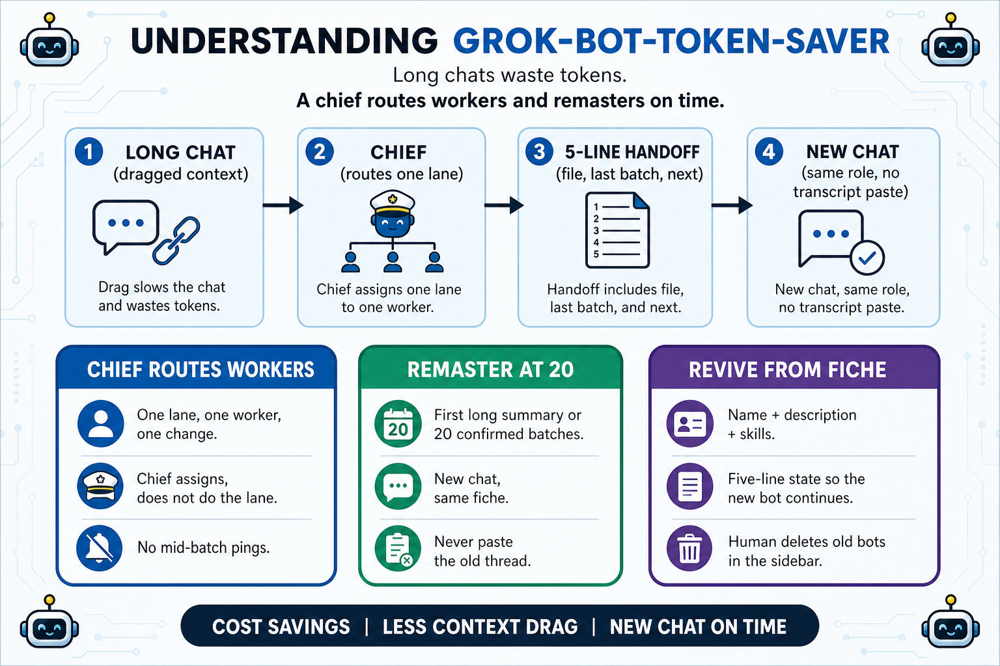
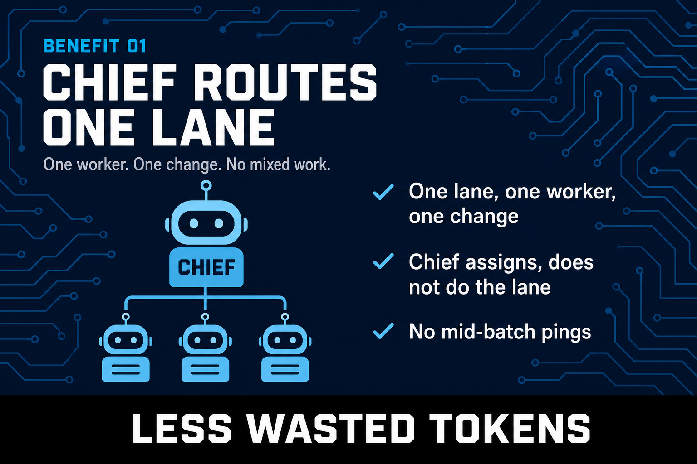
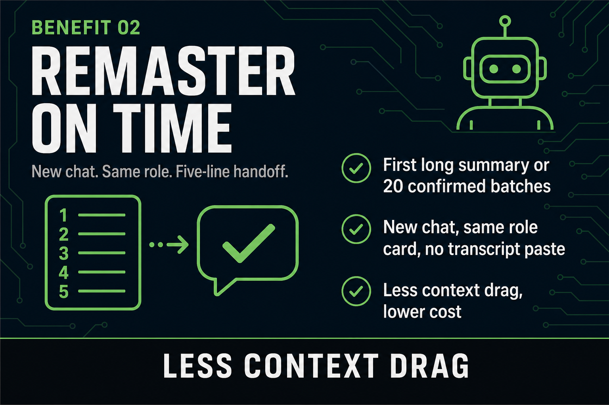
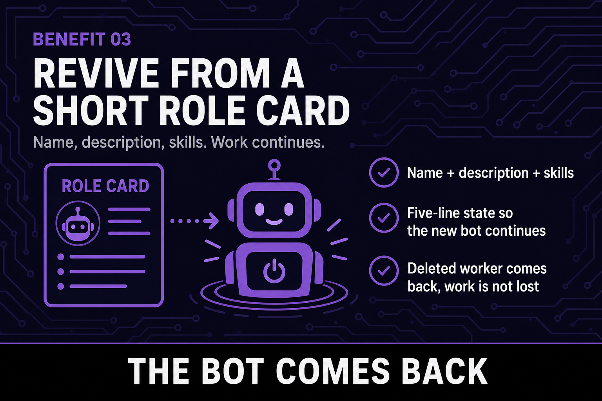

# grok-bot-token-saver

Token-thrifty chief/worker org. Remaster long chats. Revive bots from a short role card.

**Install the named chief:** [Botsi Archivist on Grok Bot](https://x.ai/bot/O_3hbkWqb1A51ZcWixGZy)

> This repo is the **mold**. The x.ai link **installs** Botsi Archivist. GitHub is not the Grok button; Grok is not this template.

## What problem does this repo solve?

Long assistant chats get expensive because **dragged context**, not because the model is clever. A new chat with no handoff is amnesia. This repo is the mold: always a chief, workers with shared rules, remaster on a timer, revive from a short fiche plus five lines of state.

> Long chat to chief to 5-line handoff to new chat.

## 3 top things you can do with this repo

1. Run a **chief** that routes one lane, one worker, one change (and does not do the lane). Named instance: [Botsi Archivist](ARCHIVIST.md).
2. **Remaster** at the first long summary or 20 confirmed batches: new chat, same role, 5-line handoff, no transcript paste.
3. **Revive** a deleted worker from a fiche (name + description + skills) so work continues.

> Chief routes one lane.

> Remaster on time.

> Revive from a short role card.

## Layout

| File | Who reads it |
|---|---|
| [ARCHIVIST.md](ARCHIVIST.md) | Named chief (install on Grok) |
| [CHIEF.md](CHIEF.md) | The one who assigns work |
| [WORKERS.md](WORKERS.md) | Every worker, every batch |
| [REVIVE.md](REVIVE.md) | Remaster a long chat, or recreate a deleted worker |

## Instance vs mold

Your own lanes, names, and tools are an **instance**. Keep them out of this mold, or in a private overlay. Botsi Archivist is the one named instance this repo ships.

## Contributing

PRs that tighten the mold are welcome. File an issue first for a new section.

## License

MIT. Use it. Fork it. Don't paste old chats into new ones.
